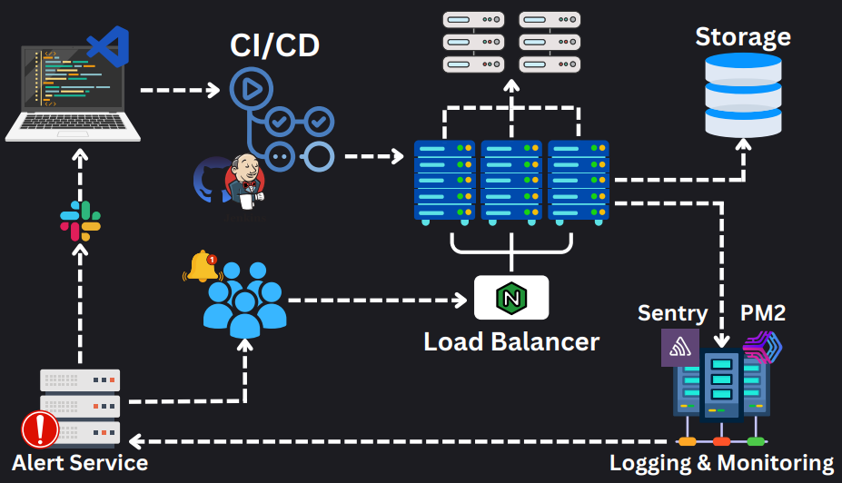
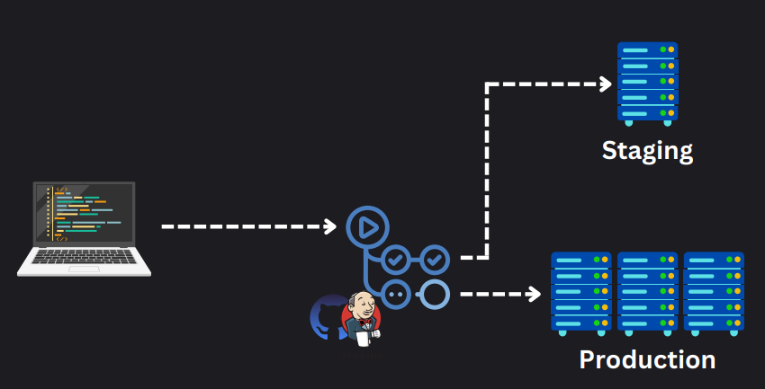

## Computer Architecture

- Computers work in a layered arch with different responsibilities
- The essential components of PC hardware include
  - CPU: the main brain of the computer, responsible for compiling and executing OS, system applications, background processes, etc. When you create code (Python, Java), it is first converted into machine-readable code (binary) by the compiler/interpreter for the CPU to execute. 
    - Compiler translates the entire program at once before running while an interpreter runs the program line-by-line in real time.
  - RAM: random-access-memory is a primary active data storer which is responsible for storing active data for fast access. This incudes application data, data structures, variables. This is volatile memory which means that the RAM is cleared when the PC is restarted. 
  - Cache: this is a smaller memory unit which allows for much faster data access compared to RAM. When the CPU wants to load a program/data, it first checks the L1,L2,L3,L4 cache and then visits the RAM if needed. The purpose of the cache is reduce the average time for data access/retrieval. This is also a volatile type of storage.
  - Hard drive: this is main non-volatile memory used by the PC for storing OS, application, user data, etc. This comes in HDD and SSD forms. HDD is the traditional and cheaper option but leads to slower reads/writes, the SSD is a much faster option for reads/writes but also more expensive. Most systems are now in SSD. 
  - Motherboard: the main board that provides connections, data pathways and communication between the CPU, RAM, Cache, HDD, GPU, controllers, etc for functionality. 

## High-level Architecture

The high level architecture of a software system consists of the following:

- **CI/CD**: continuous integration and continuous deployment pipelines. This allows for your code/repo to go through a variety of custom and automated tests/checks before automated deployment. Platforms include Jenkins and GitHub actions.
- **Load balancer**: once the project is deployed to production server, the app has to serve many incoming requests, this is handled by a load balancer or reverse proxy (reverse proxy sits in-front of the server and acts on its behalf to handle incoming requests for servers, client is unaware it is talking to a proxy. A forward proxy sits in between the client and internet and acts on behalf of the client to access the internet while protecting it, the client is aware of the proxy). 
- **External storage**: to store data, we have an external storage server (that is not on the production server) that is connected to production server via a network. 
- **Logging and Monitoring**: to get an idea of specific events and issues for debugging, external services are used for active logging and monitoring of the system. Services like Kibana and Sentry allow for this. 
- **Alert service**: when issues arise, an alert service is set up to detect issues (from logging service), triage it, and publish it to a automated notification service (like Slack or Teams) to notify team members of issue. 

##### Debugging Issues

In most cases, when errors occur, developers first try to understand it via logging/monitoring or alert service. After gaining some context, it will replicated in a staging/QA or testing env to determine a solution (not a production env). 

## System Design

#### Good Design Pillars

- **Scalability:** system is able to grow with higher number of requests and users.
- **Maintainability:** ensuring the system can easily be extended/improved or changed in the future by developers. 
- **Efficiency:** system makes the best use of resources to accomplish its tasks correctly (throughput, response time, latency are sample metrics here).
- **Reliability:** building a system that not only performs well when everything is running smoothly but designing where it can maintain its function during issues (db sharding, server replication, etc).

#### How data flows

- **Moving data**: need to decide if data flows between server-server, server-client, server-db, etc. How data flows determine how you design the application's data flow mechanism, safety checks and fault tolerances. 
- **Storing data:** this involves not only determining what DB to choose to store data but analyzing access patterns, tradeoffs, backup solutions, indexing strategies. 
- **Transforming data:** decide how the data will be transformed via aggregration, slicing, format conversion, translation, transformation, etc before it is used in the application or available to users. 

#### CAP Theorem

- Consistency: